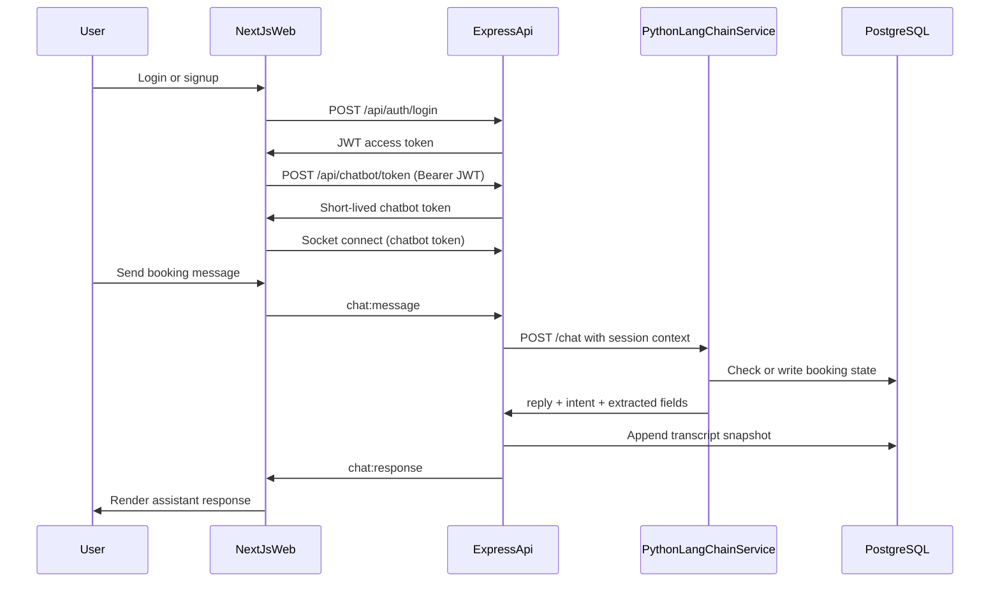

# TeraLeads Senior AI Engineer Assessment

Functional prototype for an AI appointment-booking chatbot with explicit service boundaries, practical LLM orchestration, and explainable architecture choices.

If you want a quick walkthrough of architecture decisions, check `docs/engineering-decisions.md`.

## What This Delivers

- Real-time chatbot UX for booking workflows
- Signup/login authentication and session-scoped chat token flow
- Backend middleware stack (validation, logging, rate limiting, centralized errors)
- Python LangChain microservice for multi-turn orchestration
- PostgreSQL schema with indexes and seed data
- Documentation focused on engineering decisions and tradeoffs

## Requirement Coverage Snapshot

| Area | Status | Notes |
|---|---|---|
| Frontend chatbot UI (React/Next.js) | Done | Next.js App Router with auth + Socket.IO chat |
| Real-time updates (WebSockets or polling) | Done | Socket.IO websocket path |
| Basic authentication/session handling | Done | JWT-based auth and chat-scoped token |
| `POST /api/chatbot/token` | Done | Short-lived token minted after auth |
| Middleware composition | Done | Logging, validation, rate limiting, error handling |
| Python LangChain service | Done | Prompted response generation + fallback path |
| Multi-turn state management | Done | Session memory + extracted booking slots |
| Appointment flow | Done | Collect -> validate -> availability -> upsert appointment |
| Interaction logging | Done | Chat transcript persistence + structured AI logs |
| PostgreSQL schema + sample data | Done | `users`, `appointments`, `chat_sessions` + indexes |

## Architecture Overview



## Why This Architecture

### 1) Service boundaries are intentional
- `apps/api` owns auth, transport, and request governance.
- `apps/ai-service` owns conversational reasoning and booking orchestration.
- This keeps LLM concerns isolated from authentication and socket plumbing, which simplifies scaling and testing later.

### 2) Short-lived chatbot token instead of reusing access JWT
- Access token authorizes user identity.
- Chatbot token authorizes socket/session use with tighter TTL and narrower scope.
- This reduces blast radius if a socket token leaks and keeps trust boundaries cleaner.

### 3) Deterministic booking checks for prototype reliability
- Availability is intentionally simulated and deterministic.
- This makes demos and evaluation repeatable without external calendar dependency risk.
- Real provider integration can be added behind the same scheduler interface.

### 4) Hybrid extraction strategy in AI service
- Lightweight regex extraction acts as a deterministic baseline for core slots.
- LangChain prompt then handles conversational response quality and follow-ups.
- If no model key is configured, fallback responses keep the full flow testable offline.

## Repository Structure

```text
apps/
  web/          # Next.js frontend (auth + chat UI)
  api/          # Express API + Socket.IO gateway
  ai-service/   # FastAPI + LangChain booking logic
db/
  schema.sql    # DDL + indexes
  seed.sql      # sample users, sessions, appointments
docs/
  engineering-decisions.md
```

## Local Setup

### Prerequisites
- Node.js 20+
- Python 3.11+
- PostgreSQL 14+

### 1) Configure environment
Copy `.env.example` to `.env` at repo root and fill values.

Important variables:
- `POSTGRES_URL`
- `API_PORT`
- `API_JWT_SECRET`
- `API_CHATBOT_TOKEN_SECRET`
- `API_CHATBOT_TOKEN_TTL`
- `API_FRONTEND_ORIGIN`
- `AI_SERVICE_URL`
- `NEXT_PUBLIC_API_BASE_URL`
- `NEXT_PUBLIC_SOCKET_URL`
- `OPENAI_API_KEY` (optional; fallback path exists)
- `AI_MODEL_NAME`

### 2) Initialize database

```bash
psql $POSTGRES_URL -f db/schema.sql
psql $POSTGRES_URL -f db/seed.sql
```

### 3) Install JS deps

```bash
npm install
```

### 4) Run API service

```bash
npm run dev:api
```

Default: `http://localhost:4000`

### 5) Run web app

```bash
npm run dev:web
```

Default: `http://localhost:3000`

### 6) Run AI service

```bash
cd apps/ai-service
python -m venv .venv
source .venv/bin/activate  # PowerShell: .venv\\Scripts\\Activate.ps1
pip install -r requirements.txt
uvicorn app.main:app --reload --port 8000
```

Default: `http://localhost:8000`

## API and Socket Contract

### Auth and token endpoints
- `POST /api/auth/signup`
  - body: `{ "email": "user@example.com", "password": "password123" }`
  - response: `{ user, accessToken }`
- `POST /api/auth/login`
  - body: `{ "email": "user@example.com", "password": "password123" }`
  - response: `{ user, accessToken }`
- `POST /api/chatbot/token`
  - header: `Authorization: Bearer <accessToken>`
  - response: `{ token, expiresIn }`
- `GET /health`

### Socket events
- client -> server: `chat:message` with `{ sessionId, message }`
- server -> client: `chat:response` with `{ sessionId, reply, intent, extracted }`
- server -> client: `chat:error` with `{ error, details? }`

## Data Model Notes

- `users`: auth identity and profile root
- `appointments`: booking state keyed by `session_id` for conversational updates
- `chat_sessions`: transcript snapshots + intent metadata for analytics/debugging

Indexes are tuned for expected access patterns:
- `users(email)` for login lookup
- `appointments(user_id, appointment_at)` for user calendar queries
- `chat_sessions(session_id)` for session lookup
- `chat_sessions(user_id, last_activity_at desc)` for activity feeds and analytics windows

## Security and Reliability Choices

- Password hashing via bcrypt
- JWT auth with separate chat token secret
- Rate limiting on API requests
- Request validation with Zod
- Error boundaries at both REST and socket layers
- Transcript persistence independent of frontend state

## Assumptions

- Single active appointment thread per `session_id`
- Chat starts after user is authenticated
- Scope is booking-oriented conversations, not general assistant behavior

## Known Limitations

- No refresh token rotation
- In-memory AI memory resets on AI service restart
- Regex extraction is intentionally narrow for prototype scope
- No external calendar integration yet
- No full observability stack (metrics/tracing dashboards)

## What I Would Ship Next (If This Became Product Work)

1. Replace in-memory memory with Redis + TTL policies.
2. Add formal tool-calling for extraction and scheduling actions.
3. Introduce robust retries/circuit-breakers between API and AI service.
4. Add e2e tests across auth + socket + booking lifecycle.
5. Harden auth with refresh tokens, rotation, and secret management.
6. Add tracing and domain metrics (`time_to_booking`, `slot_fill_rate`, `handoff_rate`).
